# NexAnime

[](https://nextjs.org)
[](https://react.dev)
[](https://github.com/tursodatabase/libsql)
[](LICENSE)

Self-hosted anime streaming and tracking platform. Browse, watch, track progress, maintain a watchlist, and get notified about new episodes.

---

## Preview

<div align="center">
<style>
  .gallery { position: relative; max-width: 900px; margin: 0 auto; overflow: hidden; border-radius: 12px; border: 1px solid #30363d; }
  .gallery input[type="radio"] { display: none; }
  .gallery .slides { display: flex; transition: transform 0.4s ease; }
  .gallery .slide { min-width: 100%; box-sizing: border-box; }
  .gallery .slide img { width: 100%; display: block; }
  .gallery .slide-label { padding: 12px; font-size: 14px; font-weight: 600; color: #c9d1d9; background: #161b22; }
  .gallery .nav { position: absolute; top: 50%; transform: translateY(-50%); background: rgba(0,0,0,0.6); color: #fff; border: none; padding: 12px 16px; cursor: pointer; font-size: 18px; border-radius: 8px; z-index: 10; }
  .gallery .nav:hover { background: rgba(0,0,0,0.8); }
  .gallery .prev { left: 8px; }
  .gallery .next { right: 8px; }
  .gallery .dots { display: flex; justify-content: center; gap: 8px; padding: 12px; background: #161b22; }
  .gallery .dot { width: 10px; height: 10px; border-radius: 50%; background: #30363d; cursor: pointer; transition: background 0.2s; }
  #g1:checked ~ .slides { transform: translateX(0%); }
  #g2:checked ~ .slides { transform: translateX(-100%); }
  #g3:checked ~ .slides { transform: translateX(-200%); }
  #g4:checked ~ .slides { transform: translateX(-300%); }
  #g5:checked ~ .slides { transform: translateX(-400%); }
  #g6:checked ~ .slides { transform: translateX(-500%); }
  #g7:checked ~ .slides { transform: translateX(-600%); }
  #g8:checked ~ .slides { transform: translateX(-700%); }
  #g9:checked ~ .slides { transform: translateX(-800%); }
  #g10:checked ~ .slides { transform: translateX(-900%); }
  #g11:checked ~ .slides { transform: translateX(-1000%); }
  #g12:checked ~ .slides { transform: translateX(-1100%); }
  #g1:checked ~ .dots .dot:nth-child(1),
  #g2:checked ~ .dots .dot:nth-child(2),
  #g3:checked ~ .dots .dot:nth-child(3),
  #g4:checked ~ .dots .dot:nth-child(4),
  #g5:checked ~ .dots .dot:nth-child(5),
  #g6:checked ~ .dots .dot:nth-child(6),
  #g7:checked ~ .dots .dot:nth-child(7),
  #g8:checked ~ .dots .dot:nth-child(8),
  #g9:checked ~ .dots .dot:nth-child(9),
  #g10:checked ~ .dots .dot:nth-child(10),
  #g11:checked ~ .dots .dot:nth-child(11),
  #g12:checked ~ .dots .dot:nth-child(12) { background: #58a6ff; }
</style>
<div class="gallery">
  <input type="radio" name="gallery" id="g1" checked>
  <input type="radio" name="gallery" id="g2">
  <input type="radio" name="gallery" id="g3">
  <input type="radio" name="gallery" id="g4">
  <input type="radio" name="gallery" id="g5">
  <input type="radio" name="gallery" id="g6">
  <input type="radio" name="gallery" id="g7">
  <input type="radio" name="gallery" id="g8">
  <input type="radio" name="gallery" id="g9">
  <input type="radio" name="gallery" id="g10">
  <input type="radio" name="gallery" id="g11">
  <input type="radio" name="gallery" id="g12">
  <label for="g12" class="nav prev">&#10094;</label>
  <label for="g2" class="nav next">&#10095;</label>
  <div class="slides">
    <div class="slide">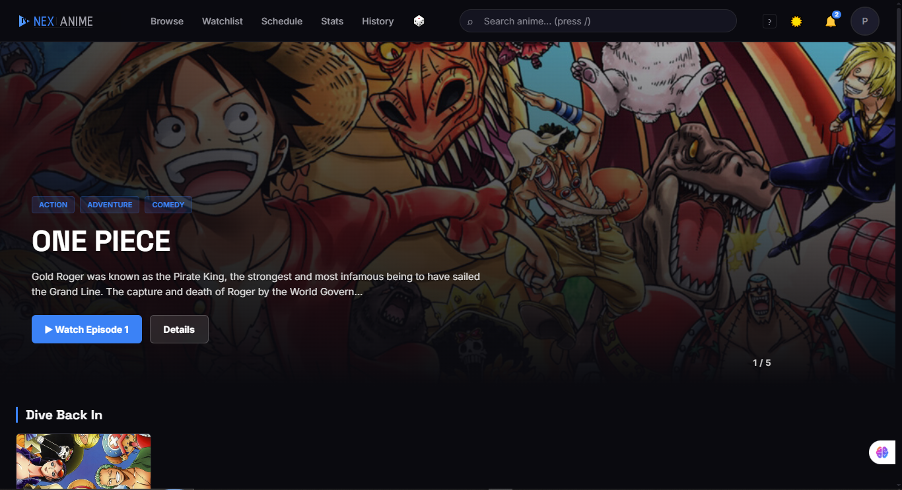<div class="slide-label">Home — Carousel</div></div>
    <div class="slide">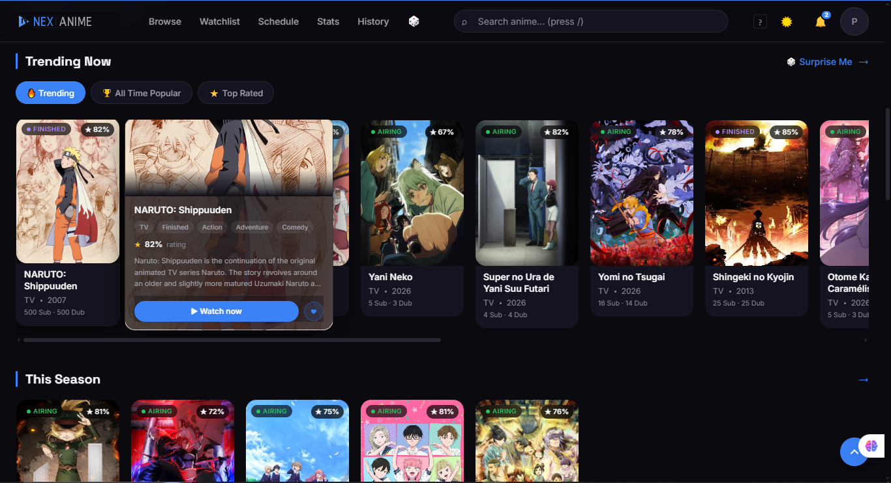<div class="slide-label">Home — Trending</div></div>
    <div class="slide">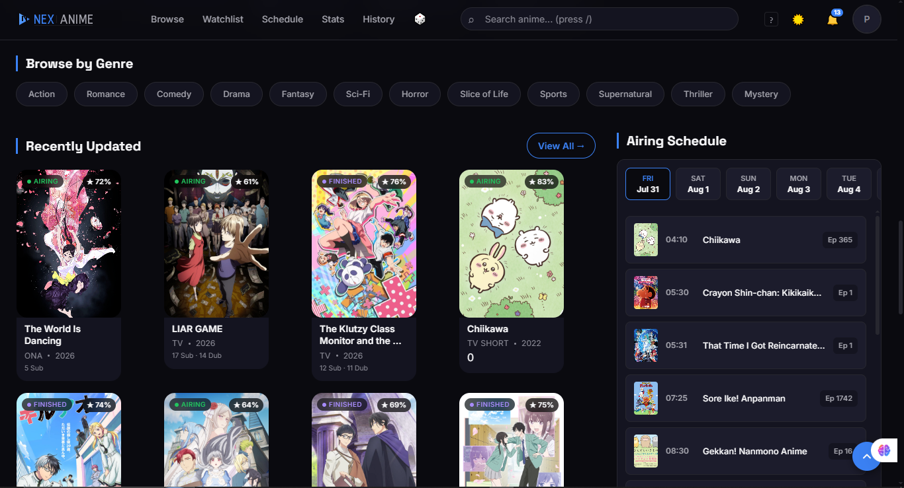<div class="slide-label">Home — Recently Updated</div></div>
    <div class="slide">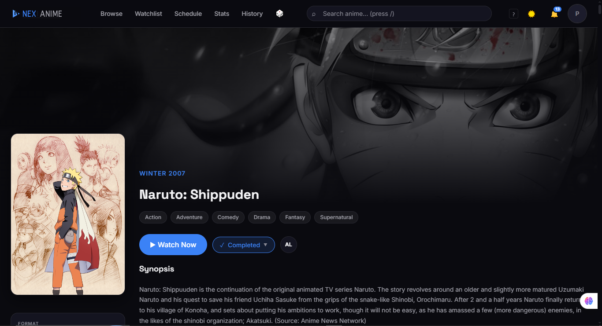<div class="slide-label">Anime Detail</div></div>
    <div class="slide">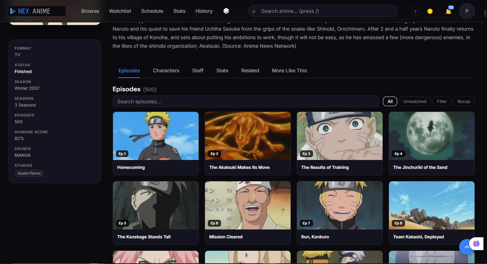<div class="slide-label">Anime Episodes</div></div>
    <div class="slide">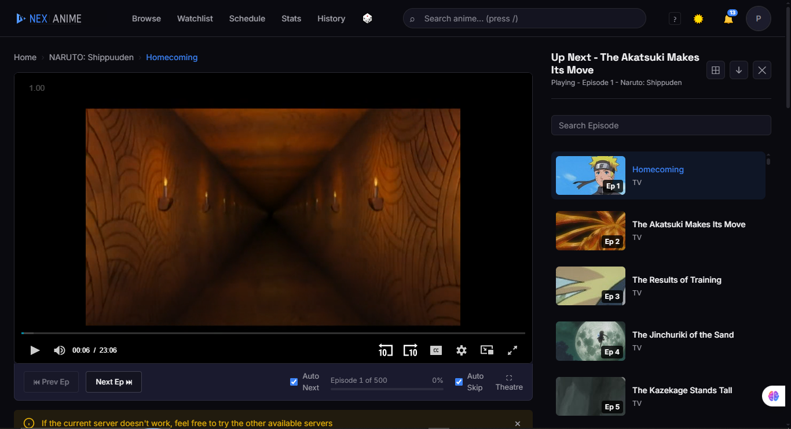<div class="slide-label">Watch — Player</div></div>
    <div class="slide">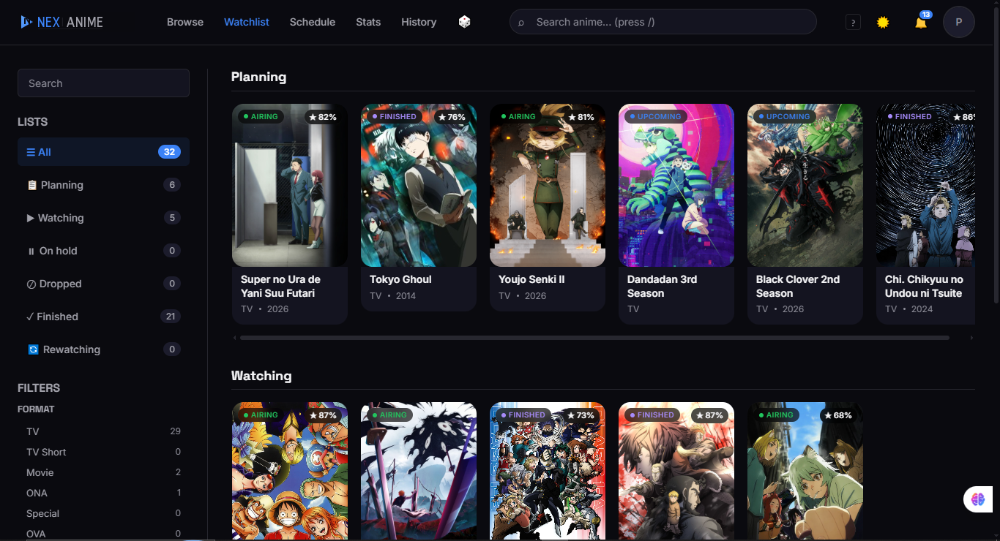<div class="slide-label">Watchlist</div></div>
    <div class="slide">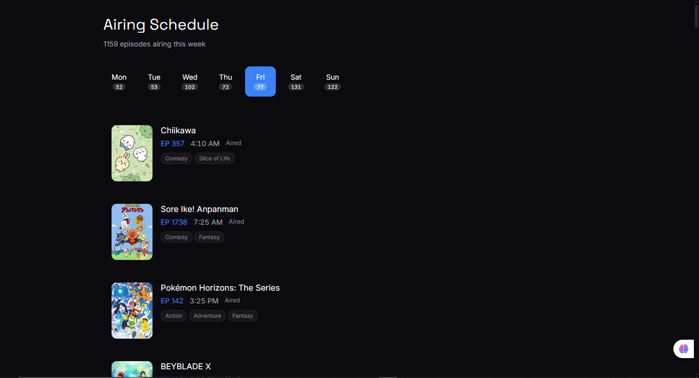<div class="slide-label">Airing Schedule</div></div>
    <div class="slide">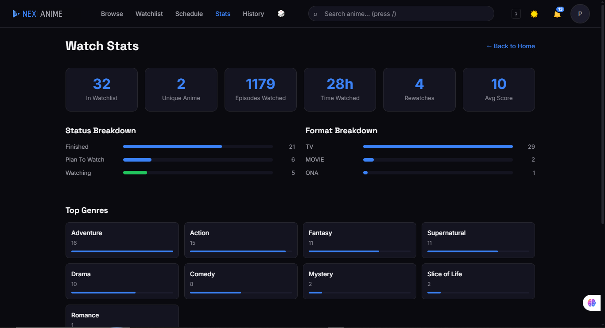<div class="slide-label">Watch Stats</div></div>
    <div class="slide">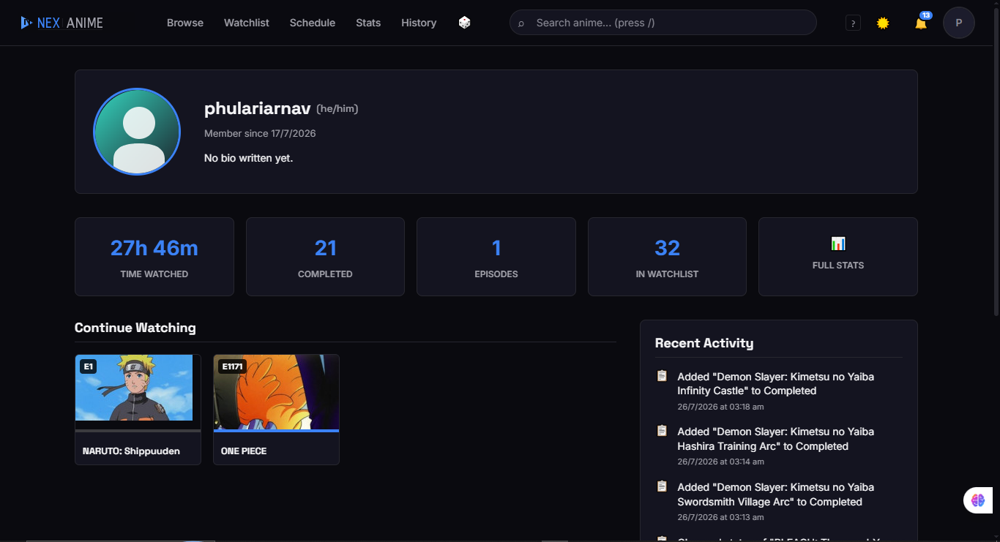<div class="slide-label">Profile</div></div>
    <div class="slide">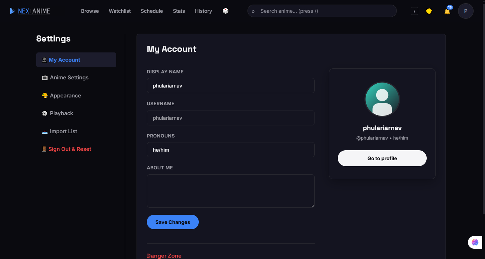<div class="slide-label">Settings</div></div>
    <div class="slide">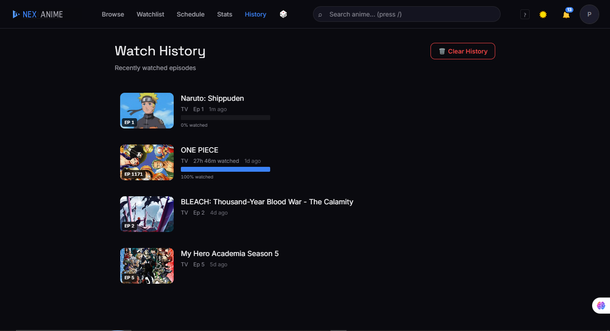<div class="slide-label">Watch History</div></div>
  </div>
  <div class="dots">
    <label for="g1" class="dot"></label>
    <label for="g2" class="dot"></label>
    <label for="g3" class="dot"></label>
    <label for="g4" class="dot"></label>
    <label for="g5" class="dot"></label>
    <label for="g6" class="dot"></label>
    <label for="g7" class="dot"></label>
    <label for="g8" class="dot"></label>
    <label for="g9" class="dot"></label>
    <label for="g10" class="dot"></label>
    <label for="g11" class="dot"></label>
    <label for="g12" class="dot"></label>
  </div>
</div>
</div>

---

## Quick Install

### Windows

Clone the repo, then double-click `install.cmd` (or run it in PowerShell):

```bash
git clone https://github.com/hackers-reality/NexAnime.git
cd NexAnime
install.cmd
```

Once done, open a **new** terminal and type:

```
nexanime
```

### Mac / Linux

```bash
git clone https://github.com/hackers-reality/NexAnime.git
cd NexAnime
chmod +x install.sh
./install.sh
```

Open a **new** terminal and type:

```
nexanime
```

The `nexanime` command starts the server and opens your browser automatically. On first run it builds the project, which takes a minute.

### Manual Install

```bash
git clone https://github.com/hackers-reality/NexAnime.git
cd NexAnime
npm install
npm run build
npm run start
```

Server runs at `http://localhost:3000`.

---

## Features

### Playback
- Multi-server streaming with auto-failover (Zoko, MegaPlay, VidStreaming, StreamTape)
- Dub/Sub toggle with server-specific source switching
- Auto-skip intro/outro
- Auto-play next episode
- Keyboard shortcuts: `T` theatre mode, `E` episode list, `M` mute, `,`/`.` playback speed, `Shift+Left/Right` prev/next episode
- Mini-player with drag support (persists across pages)
- Progress tracking — saves watched position, resumes where you left off

### Browse & Discovery
- Trending tabs (TODAY, THIS WEEK, THIS MONTH) from AniList + reanime
- Recently Updated with live episode counts
- Upcoming anime with airing countdown timers
- Genre quick-links
- Full-text search with merged results (AniList + reanime)
- Anime detail pages with characters, staff, relations, recommendations

### Watchlist & Tracking
- Categories: All, Planning, Watching, On Hold, Dropped, Finished, Rewatching
- Inline status badges on cards — update without opening modals
- Progress stats: hours watched, episodes completed
- Watch history with timestamps
- AniList watchlist import

### Settings
- Account: display name, avatar, pronouns, data reset
- Playback: auto-play, auto-skip, video quality
- Appearance: Dark / Light / System theme
- Anime listing style preferences

### Notifications
- Auto-updates check on startup
- Real-time anime update notifications from AniList
- Episode release notifications

### Keyboard Shortcuts
| Key | Action |
|-----|--------|
| `/` | Focus search |
| `?` | Show shortcuts overlay |
| `g` then `h/b/w/s` | Go to Home/Browse/Watchlist/Stats |
| `T` | Toggle theatre mode |
| `E` | Toggle episode list |
| `M` | Toggle mute |
| `,` / `.` | Decrease/increase playback speed |
| `Shift+Left/Right` | Previous/next episode |

---

## Tech Stack

- **Framework**: [Next.js 16](https://nextjs.org/) (App Router, Turbopack)
- **UI**: [React 19](https://react.dev/), CSS Modules, glassmorphic design
- **Database**: [LibSQL / SQLite](https://github.com/tursodatabase/libsql)
- **Video**: HLS.js, multi-source embed players
- **APIs**: AniList GraphQL, reanime.to, Jikan (MAL), HiAnime
- **PWA**: Service worker, offline support, installable

---

## Project Structure

```
app/
  api/          # Route handlers (progress, watchlist, settings, stream, meta, etc.)
  watch/        # Watch page with player + episode navigation
  anime/        # Anime detail pages
  browse/       # Browse/search with filters
  watchlist/    # Watchlist management
  stats/        # Viewing statistics
  settings/     # Account, playback, appearance settings
  onboarding/   # First-time user setup
components/
  cards/        # AnimeCard, ContinueWatchingCard, UpcomingCard, etc.
  player/       # VideoPlayer (HLS + embed + mini-player)
  shared/       # Header, SearchDropdown, BackToTop, Toast, etc.
  watchlist/    # WatchlistStatusBadge
lib/
  anilist.ts    # AniList GraphQL client
  reanime.ts    # reanime.to API
  hianime-api.ts # HiAnime scraper
  jikan-api.ts  # Jikan (MAL) API
  db.ts         # SQLite database + schema
  data-api.ts   # Unified data fetching layer
  settings-cache.ts # Client-side settings cache
bin/
  nexanime.js   # CLI entry point
```

---

## License

[MIT](LICENSE) — Built by [Arnav Phulari](https://github.com/hackers-reality).
